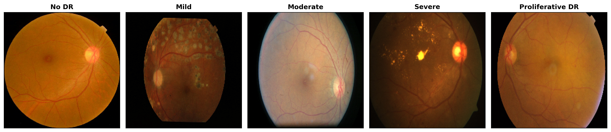

# Cross-Architecture Explainability for Diabetic Retinopathy

**Do post-hoc explanation methods behave consistently across architecturally distinct deep learning models?** This project tests that question on diabetic retinopathy (DR) grading, across five architectures spanning a network trained from scratch, pretrained convolutional networks, and vision transformers, with a leakage-audited evaluation pipeline and statistical testing of cross-architecture explanation agreement.

Research from my MRes in Artificial Intelligence, University of Wolverhampton — awarded a distinction.

---

## Why this matters

Deep learning grades DR from fundus photographs with high accuracy, but accuracy alone does not show whether a model reasons from real retinal pathology or from an incidental feature of the image. Explainability methods are meant to answer that, yet they are usually applied one method to one architecture. This work asks whether they hold up across the architecturally distinct models now in use, and evaluates that with more rigour than a heatmap-by-inspection comparison allows.

---

*The five severity grades this study grades and explains, from healthy retina to proliferative disease.*

## Key findings

- **Explanations do not transfer across architectures.** Among the gradient-based methods (Grad-CAM, saliency, SHAP), mutual agreement collapses from ~0.24 on the convolutional models to ~0.086 on the transformers, a drop of about two-thirds. <!-- ⚠ VERIFY: 0.24, 0.086, "two-thirds" against final PDF -->
- **LIME is the most architecture-agnostic method** — not the uniformly most faithful. Its agreement with the gradient methods changes least across the CNN–transformer boundary; on Swin-Base it agrees with them significantly more than they agree among themselves (paired Wilcoxon signed-rank, p < 0.001). <!-- ⚠ VERIFY: Swin-Base, p-value -->
- **A data-leakage audit changed the results.** Perceptual-hash deduplication found 187 near-duplicate clusters (~14% of the data); leaving them in inflates test accuracy by 5–30 points. Every model was trained on the deduplicated, group-aware split. <!-- ⚠ VERIFY: 187, 14%, "5–30 points" -->
- **Preprocessing is not a substitute for pretraining.** A circular-masking experiment intended to move attention off the image boundary instead relocated it to the mask edge; pretraining, not preprocessing, is what draws a model toward retinal tissue.
- **The architectural ordering holds under segmentation.** Repeating the comparison on pixel-level lesion segmentation (IDRiD) reproduced the same ordering, with the transformer-based model segmenting every structure at least as well as the pretrained network. <!-- ⚠ VERIFY: matches "at least as well as" phrasing in your write-up -->
- ### Explanation agreement across architectures


*Pairwise agreement between explanation methods, per architecture. Mutual agreement among the gradient methods (Grad-CAM, saliency, SHAP) is visible on the convolutional models but collapses on the transformers (DeiT-Base, Swin-Base).*


*LIME's agreement with the gradient-based methods holds up more consistently across the CNN–transformer boundary than the gradient methods' agreement with each other.*


*The same correctly-classified images explained four ways (Grad-CAM, Saliency, SHAP, LIME). T: true grade, P: predicted grade. The methods highlight different regions of the same image — the disagreement the agreement metrics quantify.*

## Approach at a glance

| Stage | What it does |
|---|---|
| Leakage audit | Perceptual hashing + union-find to build a deduplicated, group-aware 70/15/15 split, reused unchanged by every model |
| Classification | Five architectures (scratch CNN, Inception V3, ConvNeXt-Tiny, DeiT-Base, Swin-Base), multi-seed training, class-imbalance ablation |
| Explainability | Grad-CAM, saliency, SHAP, LIME (+ attention rollout / windowed attention) on a fixed 30-image set; deletion/insertion faithfulness and top-k IoU agreement with paired significance testing |
| Masking | Radius-scaled circular masking, retraining, and before/after explanation comparison |
| Segmentation | IDRiD tiling, three U-Net encoders, Dice + weighted-BCE loss, per-lesion metrics |

<!-- Suggested: embed 2-3 result figures here once the repo is public.
     e.g. the cross-method agreement figure, a Grad-CAM comparison panel,
     and the class-example fundus images. Recruiters skim visuals first. -->

## Repository structure

Each stage is a folder of Jupyter notebooks, numbered in run order. Gaps in the numbering reflect the working sequence and are intentional.

```
.
├── 01_leakage_audit/     # Perceptual-hash duplicate audit and deduplicated group-aware split
├── 02_classification/    # Five architectures, multi-seed protocol, imbalance ablation
├── 03_explainability/    # Grad-CAM, saliency, SHAP, LIME, attention; faithfulness + IoU + Wilcoxon
├── 04_masking/           # Circular retinal masking experiment
└── 05_segmentation/      # IDRiD tiling, three U-Net encoders, per-lesion metrics
```


## Running it

```bash
python -m venv .venv
source .venv/bin/activate        # Windows: .venv\Scripts\activate
pip install -r requirements.txt
```

Pinned versions are in `requirements.txt`. A CUDA-capable GPU is recommended; the reported experiments used Kaggle GPU runtimes. Run the notebooks in folder order; the leakage-audit split is written first and reused by every downstream stage.

**Key libraries:** PyTorch, timm, segmentation-models-pytorch, SHAP, LIME, OpenCV, scikit-image, scikit-learn, SciPy, NumPy, pandas, Matplotlib.

## Data

Not included here; both datasets are public:

- **Kaggle DR dataset** (5-class grading, 3,554 fundus images): `shajinrp/diabetic-retinopathy` on Kaggle. <!-- ⚠ VERIFY: 3,554 image count -->
- **IDRiD** (Indian Diabetic Retinopathy Image Dataset, pixel-level lesion masks): Porwal et al. (2018), via IEEE DataPort / the IDRiD grand-challenge page.

## Reproducibility

Each run seeds the Python, NumPy and PyTorch generators and the data-loader generator, and places cuDNN in deterministic mode. Run-to-run variation is nonetheless substantial for the convolutional models on this dataset, which is why results are reported across multiple seeds (five for the CNNs, three for the transformers) rather than from single runs. <!-- ⚠ VERIFY: five CNN seeds, three transformer seeds -->

## Full write-up

The complete methodology, results and discussion are in the dissertation:
Okafor, T.E. (2026) *Secure and Explainable Deep Learning Models and Transformers for Healthcare Diagnostics: A Case Study on Diabetic Retinopathy.* MRes dissertation, University of Wolverhampton.
<!-- Add: link to the PDF, and to the published paper once it lands. -->

## Acknowledgements

Supervised by Hiran Patel, School of Architecture, Computing and Engineering, University of Wolverhampton.

## License

Released under the MIT License for academic and portfolio use. The referenced datasets are subject to their own licenses and terms of use.
